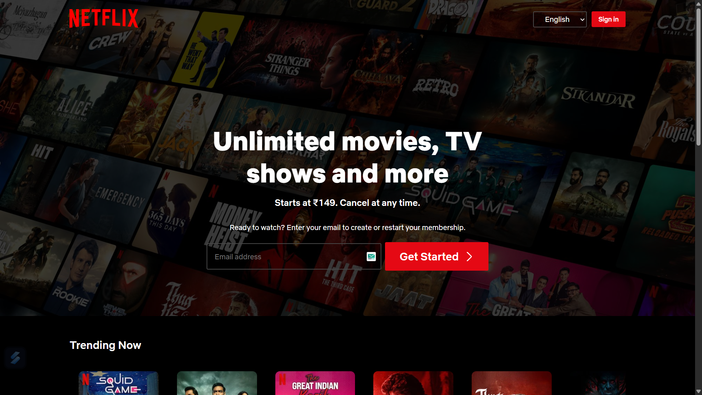

# 🎬 Nefilx-ui Clone (HTML & CSS)

A simple **Nefilx-ui Clone** built using **HTML** and **CSS**.  
⚠️ This project is purely for **learning purposes only** – not affiliated with Netflix.

---

## 🚀 Live Demo  
👉 [View Project](https://movie-ui-clone-x05.vercel.app/)

---

## 📸 Preview  


---

## ✨ Features  
- Hero section with background image  
- Nefilx-style navigation bar  
- Responsive layout for all devices  
- Movie & TV show cards grid  
- Smooth hover effects on cards  

---

## 🛠 Tech Stack  
- **HTML5**  
- **CSS3** (Flexbox, Grid)  

---

## 📂 How to Run  

1. Clone the repository:
   ```bash
   git clone https://github.com/shahidx05/Neflix-Clone.git
